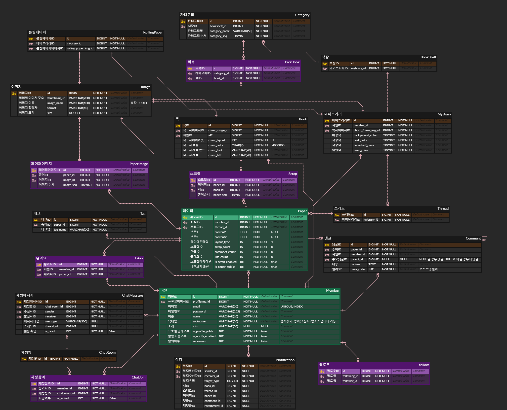
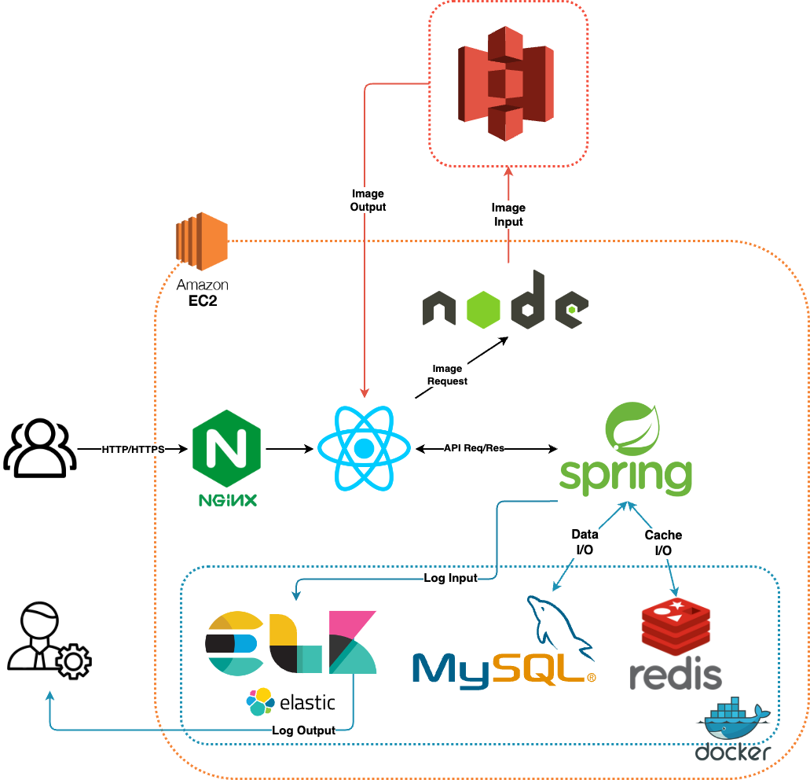

# Mybrary

### 🏆삼성 청년 SW아카데미(SSAFY) 10th 공통 프로젝트 최우수상(1위)🏆


## ✅ 프로젝트 진행 기간

### 2024.01.08 ~ 2024.02.16(6주)

## **✅ 프로젝트 소개**

**🚩 서비스 한줄 소개**

```bash
라이브러리 형식의 SNS 서비스
"게시물로 책을 엮고, 책을 모아 나만의 공간을 만드는 차세대 SNS ‘Mybrary’"
```

**🚩 기획 배경**

프로젝트 팀원들이 느낀 기존 SNS에서는 다음과 같은 아쉬운 점들이 있었습니다.

* 사용자가 다른 이용자를 팔로우 하게 된다면 그 이용자가 올리는 모든 게시물들이 노출된다는 점입니다. 다른 이용자가 게시하는 특정 컨텐츠만을 꾸준히 접하기에 어려움이 따르는 점이 아쉬웠습니다. 

* 기존의 sns에서는 다른 이용자의 게시글의 단순 공유는 가능했지만, 타인의 컨텐츠를 바탕으로 새로운 창작물을 만들기에 어려움이 있었습니다.

* 글 작성 형식이 한정적이어서 다양한 형태의 컨텐츠를 표현하기에 제약이 따른다는 점입니다.

**🚩 프로젝트 설명 및 목표**

그러한 기존 SNS 상의 아쉬운 점들을 바탕으로 개선된 SNS 서비스를 기획하여 만들어진 “Mybrary”의 핵심 기능들을 다음과 같이 소개합니다. 

* Mybrary는 '페이퍼'라는 개별 게시글을 '스레드'로 모으고, 이를 '책'으로 묶어 관리할 수 있습니다.

* 공유 게시물 단위인 ‘스레드’와 ‘책’은 공개 설정이 되어있는 한 다른 이용자를 통해 공유될 수 있습니다. 

* 스레드의 경우, 스크랩 기능을 통하여 타인의 책에 포함될 수 있습니다.

* 책은 구독 기능을 통해 타인의 책장에 꽂힐 수 있어 원작자의 정보를 포함한 공유 메커니즘이 이루어집니다.

* 공개 설정된 스레드들은 메인 피드에 랜덤하게 노출될 수 있으나 이용자가 구독한 책을 통한다면 관심 있는 컨텐츠만을 선별적으로 접할 수 있고, 여러 이용자들의 생각과 경험이 담긴 하나의 책이 생성될 수 있는 점이 마이브러리의 특징입니다. 

* 예를 들어, “대전 최고 빵집”이라는 책을 생성해 다른 이용자들이 올린 관련 스레드들을 모아 하나로 엮을 수 있습니다. 한 사람보다는 여러 이용자들의 컨텐츠들이 모여 더 큰 시너지를 낼 수 있다는 저희의 생각이 있었습니다.

* 마이브러리의 스레드를 생성할 때는 다양한 글꼴 옵션과 글 레이아웃 타입들을 제공하기에 이용자의 기호에 맞춘 다양한 모습의 게시물을 만들어낼 수 있습니다. 선택지가 다양하다는 점에 따라 다양한 모습의 컨텐츠들이 생산될 수 있고, 이는 이용자들이 서비스를 더욱 재미있게 즐길 수 있는 요소가 될 수 있습니다.

**🚩 프로젝트 확장성**

Mybrary는 사용자들이 더욱 만족할 수 있는 SNS 경험을 제공하기 위해 세 가지 확장성 또한 고려할 수 있습니다.

* 콜드스타트 이슈를 완화하기 위한 책 및 사용자 추천 기능

* 게시글의 PDF 변환 및 실물 책 제작 서비스

* 모바일 화면 비율에 맞는 UI 개발과 앱 출시


## ✅ 멤버소개


<!--
## ✅ 기술스택

<table>
    <tr>
        <td><b>Back-end</b></td>
        <td>


<br>


<br>


</td>
    </tr>
    <tr>
    <td><b>Front-end</b></td>
    <td>


<br>


    </td>
    </tr>
    <tr>
    <td><b>Infra</b></td>
    <td>


</td>
    <tr>
    <td><b>Tools</b></td>
    <td>
    
    

    </td>
    </tr>
</table>
-->

## ✅ 프로젝트 구조

### Back-end
```
├── main
└──
   ├── java
   │   └── com
   │       └── mybrary
   │           └── backend
   │               ├── BackendApplication.java
   │               ├── domain
   │               │   ├── base
   │               │   │   └── BaseEntity.java
   │               │   ├── book
   │               │   │   ├── controller
   │               │   │   ├── dto
   │               │   │   ├── entity
   │               │   │   ├── repository
   │               │   │   └── service
   │               │   ├── bookmarker
   │               │   │   ├── dto
   │               │   │   └── entity
   │               │   ├── bookshelf
   │               │   │   ├── entity
   │               │   │   └── repository
   │               │   ├── category
   │               │   │   ├── controller
   │               │   │   ├── dto
   │               │   │   ├── entity
   │               │   │   ├── repository
   │               │   │   └── service
   │               │   ├── chat
   │               │   │   ├── controller
   │               │   │   ├── dto
   │               │   │   ├── entity
   │               │   │   ├── repository
   │               │   │   └── service
   │               │   ├── comment
   │               │   │   ├── controller
   │               │   │   ├── dto
   │               │   │   ├── entity
   │               │   │   ├── repository
   │               │   │   └── service
   │               │   ├── contents
   │               │   │   ├── like
   │               │   │   │   ├── entity
   │               │   │   │   ├── repository
   │               │   │   │   └── service
   │               │   │   ├── paper
   │               │   │   │   ├── controller
   │               │   │   │   ├── dto
   │               │   │   │   ├── entity
   │               │   │   │   ├── repository
   │               │   │   │   └── service
   │               │   │   ├── paper_image
   │               │   │   │   ├── entity
   │               │   │   │   └── repository
   │               │   │   ├── scrap
   │               │   │   │   ├── entity
   │               │   │   │   └── repository
   │               │   │   ├── tag
   │               │   │   │   ├── entity
   │               │   │   │   ├── repository
   │               │   │   │   └── service
   │               │   │   └── thread
   │               │   │       ├── controller
   │               │   │       ├── dto
   │               │   │       ├── entity
   │               │   │       ├── repository
   │               │   │       └── service
   │               │   ├── elastic
   │               │   │   ├── indices
   │               │   │   └── repository
   │               │   ├── follow
   │               │   │   ├── entity
   │               │   │   └── repository
   │               │   ├── image
   │               │   │   ├── controller
   │               │   │   ├── dto
   │               │   │   ├── entity
   │               │   │   ├── repository
   │               │   │   └── service
   │               │   ├── member
   │               │   │   ├── controller
   │               │   │   ├── dto
   │               │   │   ├── entity
   │               │   │   ├── repository
   │               │   │   └── service
   │               │   ├── mybrary
   │               │   │   ├── controller
   │               │   │   ├── dto
   │               │   │   ├── entity
   │               │   │   ├── repository
   │               │   │   └── service
   │               │   ├── notification
   │               │   │   ├── controller
   │               │   │   ├── dto
   │               │   │   ├── entity
   │               │   │   ├── repository
   │               │   │   └── service
   │               │   ├── pickbook
   │               │   │   ├── entity
   │               │   │   └── repository
   │               │   ├── rollingpaper
   │               │   │   ├── controller
   │               │   │   ├── dto
   │               │   │   ├── entity
   │               │   │   ├── repository
   │               │   │   └── service
   │               │   └── search
   │               │       ├── controller
   │               │       ├── dto
   │               │       └── service
   │               └── global
   │                   ├── annotation
   │                   │   ├── AccessToken.java
   │                   │   └── Nickname.java
   │                   ├── config
   │                   │   ├── ElasticsearchConfig.java
   │                   │   ├── MailConfig.java
   │                   │   ├── QuerydslConfig.java
   │                   │   ├── RedisConfig.java
   │                   │   ├── S3Config.java
   │                   │   ├── SecurityConfig.java
   │                   │   ├── SwaggerConfig.java
   │                   │   ├── WebConfig.java
   │                   │   └── WebSocketConfig.java
   │                   ├── entrypoint
   │                   │   └── JwtAuthenticationEntryPoint.java
   │                   ├── exception
   │                   │   ├── book
   │                   │   ├── bookshelf
   │                   │   ├── category
   │                   │   ├── chat
   │                   │   ├── email
   │                   │   ├── image
   │                   │   ├── jwt
   │                   │   │   ├── AccessTokenNotFoundException.java
   │                   │   │   ├── RefreshTokenNotFoundException.java
   │                   │   │   └── UnauthorizedAccessException.java
   │                   │   ├── member
   │                   │   ├── mybrary
   │                   │   ├── paper
   │                   │   ├── pickbook
   │                   │   ├── scrap
   │                   │   ├── tag
   │                   │   └── thread
   │                   ├── filter
   │                   │   ├── EmailVerificationFilter.java
   │                   │   ├── JwtAuthenticationFilter.java
   │                   │   ├── TokenExceptionFilter.java
   │                   │   └── TokenRefreshRequestFilter.java
   │                   ├── format
   │                   │   ├── code
   │                   │   │   ├── ApiResponse.java
   │                   │   │   └── FilterResponse.java
   │                   │   └── response
   │                   │       ├── ErrorCode.java
   │                   │       └── ResponseCode.java
   │                   ├── handler
   │                   │   ├── ChatErrorHandler.java
   │                   │   └── GlobalExceptionHandler.java
   │                   ├── initializer
   │                   │   └── RedisInitializer.java
   │                   ├── interceptor
   │                   │   ├── ChatStompInterceptor.java
   │                   │   └── NicknameValidInterceptor.java
   │                   ├── jwt
   │                   │   ├── RefreshToken.java
   │                   │   ├── TokenInfo.java
   │                   │   ├── provider
   │                   │   │   └── TokenProvider.java
   │                   │   ├── repository
   │                   │   │   └── RefreshTokenRepository.java
   │                   │   └── service
   │                   │       └── TokenService.java
   │                   ├── resolver
   │                   │   ├── AccessTokenArgumentResolver.java
   │                   │   └── NicknameValidArgumentResolver.java
   │                   └── util
   │                       ├── CookieUtil.java
   │                       ├── FilterUtil.java
   │                       ├── RedisUtil.java
   │                       └── cookie
   │                           ├── DevCookieUtil.java
   │                           └── ProdCookieUtil.java
   └── resources
       ├── application.yml
       └── log4j2.xml
```

### Front-end
```
├── package-lock.json
├── package.json
├── public
│   ├── favicon.ico
│   └── index.html
└── src
    ├── App.css
    ├── App.js
    ├── Main.js
    ├── api
    │   ├── book
    │   │   └── Book.js
    │   ├── category
    │   │   └── Category.js
    │   ├── chat
    │   │   └── Chat.js
    │   ├── comment
    │   │   └── Comment.js
    │   ├── common
    │   │   └── Token.js
    │   ├── image
    │   │   └── Image.js
    │   ├── member
    │   │   ├── Account.js
    │   │   ├── Follow.js
    │   │   ├── Login.js
    │   │   ├── Logout.js
    │   │   └── SignUp.js
    │   ├── mybrary
    │   │   └── Mybrary.js
    │   ├── notification
    │   │   └── Notification.js
    │   ├── paper
    │   │   └── Paper.js
    │   ├── rollingpaper
    │   │   └── RollingPaper.js
    │   ├── search
    │   │   └── Search.js
    │   └── thread
    │       └── Thread.js
    ├── assets
    │   ├── 1x
    │   │   ├── left.png
    │   │   └── right.png
    │   │   └── ...
    │   ├── icon
    │   │   └── ...
    │   ├── lottie
    │   │   ├── image.json
    │   │   └── loading.json
    │   │   └── ...
    ├── components
    │   ├── atom
    │   │   ├── Nav.js
    │   │   └── atomstyle
    │   │       ├── Nav.module.css
    │   │       └── Title.module.css
    │   ├── book
    │   │   ├── ContentItem2.js
    │   │   └── ContentItem2.module.css
    │   ├── bookshelf
    │   │   ├── BookAlbum.js
    │   │   └── ...
    │   ├── common
    │   │   ├── BigModal.js
    │   │   └── ...
    │   ├── feed
    │   │   ├── BookSelect2.js
    │   │   └── ...
    │   ├── frame
    │   │   ├── Container.js
    │   │   └── framestyle
    │   │       └── Container.module.css
    │   ├── join
    │   │   ├── LoginForm.js
    │   │   └── ...
    │   ├── mybrary
    │   │   ├── FollowList.js
    │   │   └── ...
    │   ├── paperplane
    │   │   ├── ChatProfile.js
    │   │   └── SharedPaper.js
    │   ├── threadcreate
    │   │   ├── BookSelect.js
    │   │   └── ...
    │   ├── threads
    │   │   ├── BookSelect2.js
    │   │   └── ...
    │   └── threadupdate
    │       ├── Edit.js
    │       └── ...
    ├── index.css
    ├── index.js
    ├── pages
    │   ├── BookDetailPage.js
    │   ├── ...
    │   └── style
    │       ├── BookDetailPage.module.css
    │       └── ...
    └── store
        ├── useBookStore.js
        └── ...

```


## ✅ 산출물

### ERD


### 시스템 아키텍처



## ✅ 기술 스택 세부 명세

### JPA (Java Persistence API)

- **배경**: 싸피(SSAFY) 과정에서 myBatis를 학습했으나, 제한된 개발 기간과 개발 편의성을 고려하여 JPA를 선택.
- **선택 이유**: JPA는 높은 러닝커브에도 불구하고, 관계형 데이터베이스에 대한 기본적인 이해가 있어 학습과 동시에 프로젝트에 적용 가능했음. 초기 ERD 설계 시 JPA 엔티티 설계를 고려하여, 데이터베이스 모델에 대한 빠른 이해와 후반부 최적화에 크게 기여함.
- **효과**: JPA의 도입은 개발 효율성을 크게 향상시켰으며, 프로젝트에 큰 도움이 되었음.

### Redis

- **도입 배경**: 인증/인가 과정에서 리프레시 토큰의 유효시간 관리를 위해 레디스 도입. 관계형 데이터베이스에 비해 데이터 변경 없이 빠른 접근성을 제공함.
- **적용 사례**: RestAPI에서 매 통신마다 사용자 검증을 위해 빠른 데이터 조회가 필요. 레디스를 사용하여 JWT의 유효시간을 관리하고, 이메일 인증 시스템에도 적용하여 인증번호와 TTL을 설정, 회원가입의 유효성을 확보함.
- **결과**: 사용자 인증인가 과정의 속도 향상과 회원가입 과정의 유효성 관리에 큰 이점을 가져옴.

### ELK (Elasticsearch, Logstash, Kibana)

- **목적**: 스프링 로그 정보의 효율적 관리와 빠른 파악을 위해 ELK 스택 도입.
- **구현**: Log4j2를 통한 로그 파일 생성, Logstash를 사용한 로그 수집 및 Elasticsearch 인덱싱을 통해 로그 관리 효율화.
- **활용**: 주요 콘텐츠 검색 최적화를 위해 HTML 형태의 컨텐츠를 관계형 데이터베이스와 엘라스틱서치에 동시에 저장, 빠른 색인 및 검색을 가능하게 함.

### Nginx

- **사용 목적**: HTTPS 도입을 위한 Nginx 사용. 액세스 토큰과 리프레시 토큰의 안전한 관리를 위해 HTTPS 적용 필요성 인지.
- **구현**: certbot을 통한 SSL 문서 발급과 Nginx를 사용한 HTTP to HTTPS 리다이렉션, 리버스 프록시 기능 활용.

### Node.js - 이미지 서버

- **배경**: 프로젝트의 이미지 업로드 요구 사항에 대응하기 위해 별도의 이미지 처리 서버 구축.
- **구현**: 이미지 업로드 시 서버 부하 최소화를 위해 노드 서버에서 이미지 압축 알고리즘을 적용, 저장 공간 절약 및 조회 속도 향상 기대.


## ✅ 기능 소개

### 01. 회원가입, 로그인 🧑👩


#### 회원가입
- 이메일 인증 : 메일로 받은 인증코드로 이메일 인증
- 비밀번호 유효성 검사 : 영문 대소문자, 숫자, 특수문자 각 1개 이상 조합하여 3-20자
- 이름 유효성 검사 : 한글(자음 또는 모음만 존재하는 것 제외)을 조합해 2-5자
- 닉네임 유효성 검사 : 영문자, 숫자 및 언더바를 포함할 수 있으며 3-10자

#### 로그인
- 이메일과 비밀번호로 로그인
<br>

### 02. 마이브러리 설명서 📃 / 내 정보 설정 ⚙


#### 마이브러리 설명서
- 신규회원은 기본 카테고리 3개, 기본 책 1권을 생성해 둠
- 기본책 안에 마이브러리 설명서 페이퍼를 꽂아둠
- 위 기능들로 마이브러리 서비스를 이용하는데에 용이하게 함

#### 설정
- 계정설정 : 프로필이미지 변경, 닉네임 변경, 한줄 소개 변경, 비밀번호 변경
- 알림설정 : 알림 수신 허용/비허용 설정
- 계정탈퇴 : 피드백 메시지와 함께 탈퇴요청을 받아 마이브러리 서비스를 더 개선
<br>

### 03. 마이브러리 꾸미기 🏡 / 팔로워, 팔로잉 목록 🤝


#### 마이브러리 화면 및 꾸미기
- 회원정보 조회 : 닉네임, 이름, 자기소개 표시 생성한 스레드 개수, 책 권수, 팔로워, 팔로잉 수 표시 팔로워, 팔로잉 클릭 시 리스트 모달 나타남
- 문, 책장, 책상, 우체통, 이젤 UI는 각 기능 페이지로 이동
- 마이브러리 커스텀 : 13개의 배경, 6개의 책장, 책상, 이젤 테마 커스텀 가능

#### 팔로워 / 팔로잉 목록
- 팔로워 목록 : 팔로워를 삭제할 수 있고, 내가 팔로우하지 않은 회원은 팔로우 클릭 가능
- 팔로우 목록 : 내가 팔로우 하고 있는 회원 목록 조회
<br>

### 04. 메인피드 화면 📷 / 좋아요, 댓글 기능 💕💬


#### 메인피드
- 스크롤로 다음 스레드로 넘어갈 수 있고, 화살표 클릭으로 스레드 내의 다음 페이퍼를 볼 수 있음
- 스레드의 좋아요 수, 댓글 수, 스크랩 수를 확인 가능
- \# 클릭 시 작성된 태그 목록 확인 가능

<br>

- 네비게이션 바<br>마이브러리, 메인피드페이지, PP(채팅)페이지, 검색페이지로 이동 가능

#### 댓글
- 텍스트를 입력하고 5가지의 댓글 색을 선택해 댓글 작성 가능
- 대댓글 수를 클릭해 대댓글 조회, 답글달기를 클릭해 대댓글 작성 가능<br>
  ( 대댓글은 해당 댓글의 색과 동일하게 적용 )
<br>

### 05. 스크랩 🔗 / 구독 📔


#### 스크랩
- 카테고리 별 책 리스트를 통해 스크랩할 책 선택 책의 남은 페이지 수가 표시되며 스크랩할 페이퍼 장수보다 부족한 경우 선택 불가
- 원하는 책이 없을 경우 새 책 생성 가능<br>
( -> 마이브러리 책장에서 이어서 설명 )

#### 구독
- 페이퍼가 포함된 책 목록 또는 다른 사람의 마이브러리 책장을 통해 책 상세 화면으로 이동
- 오른쪽 상단의 내 책장에 담기로 구독 가능
<br>

### 06. 스레드 작성 화면 📝


##### 레이아웃
- 1컷 레이아웃 18개, 2컷 레이아웃 19개, 총 37개의 레이아웃으로 다양한 스레드 작성 가능<br>
- 이미지 컷 수 뿐만 이미지와 텍스트 칸의 비율도 다양함<br>

##### 이미지 업로드
- 레이아웃의 비율에 맞는 이미지를 업로드해 게시 가능

##### 본문 작성
- textarea 에디터로 글꼴크기, 글꼴색, 정렬 등을 지정할 수 있음 하이퍼링크 삽입도 가능

##### 페이퍼 추가
- 최대 5개의 페이퍼까지 작성 가능 페이퍼를 이동하면서 페이퍼 작성할 수 있음

##### 태그
- 태그 선택하기를 클릭해 태그 선책 화면으로 전환<br>
- 원하는 태그를 작성해 태그 추가

##### 책 선택
- 해당 스레드를 게시와 동시에 책에 담을 수 있음 ( -> 스크랩하기와 동일 )

##### 공개 설정 및 스크랩허용 설정
- 스레드를 전체공개 / 나만보기 설정 가능
- 스레드 스크랩을 허용 / 비허용 설정 가능 ( 나만보기 설정 시 스크랩은 비허용만 가능 )
<br>

### 07. 스레드 목록 화면 (책상) 📰


- 최근 시간 순으로 정렬된 스레드 목록 조회 가능
- 스레드에 해당하는 페이퍼들의 좋아요 수, 댓글 수, 스크랩 수를 합한 개수 표시
<br>

### 08. 카테고리 화면 (책장) 📚


#### 책장
- 사용자가 정한 순서대로 카테고리 목록이 책장 UI로 표현
- 카테고리 이름과 포함된 책 권수에 따른 책 UI ( 10권 이상일 경우 초과개수로 표시 )

#### 카테고리 추가 / 수정 / 삭제
- 카테고리 추가 : 새 카테고리 추가
- 카테고리 수정 : 카테고리를 드래그해 순서 조정 ( 드래그 후 즉시 반영으로 사용자 친화적 UI )<br>
카테고리 이름 수정 가능
- 카테고리 삭제 : 카테고리에 포함된 책이 한 권도 없을 때 가능

#### 카테고리 별 책 목록 화면
- 사용자가 작성한 책 외에 구독한 책도 포함되어 조회
- 책 제목, 책 표지 이미지, 작성자 정보 표시

#### 책 상세 화면
- 책의 페이퍼가 넘어가는 UI를 적용해 아날로그적 감성을 느낄 수 있는 책 페이지<br>
좋아요, 댓글 기능을 제외해 책 자체의 내용에 집중할 수 있도록 함
- 페이퍼 옵션 : 해당 페이퍼가 포함된 스레드로 이동하기 -> 스레드 단건 조회<br>
해당 페이퍼를 책에서 제거하기
<br>

### 09. 책 생성 / 책 수정 및 삭제 📖


#### 책 생성
- 책 제목 작성 및 커버 이미지 업로드
- 6개의 책 커버 레이아웃 및 11개의 책 커버 색상으로 책 커스텀 가능
- 책을 꽂을 카테고리 선택

#### 책 수정 및 삭제
- 수정은 이미지 재업로드 불가 외 책 생성과 동일
- 삭제 시 책을 본인 포함 해당 책을 구독한 모든 사용자의 카테고리에서 책 제거되고 삭제
<br>

### 10. 롤링페이퍼 🎨


- 익명의 그림 롤링페이퍼로 다른 회원의 마이브러리에 다녀갔다는 흔적을 남길 수 있음
- 여러 사용자가 실시간으로 동기화되어 그림을 그릴 수 있음
- 12가지 펜 색상 지원
- 롤링페이퍼의 주인만 롤링페이퍼를 초기화할 수 있음
<br>

### 11. 알림 🔔


- 팔로우 알림🤝
- 댓글 알림💬
- 좋아요 알림💕
- 스크랩 알림🔗
- 구독 알림📚
- 채팅 알림📩
<br>

### 12. Paper Plane (채팅) ✈


- 마지막 메시지 날짜 기준으로 정렬되서 조회
- 실시간으로 채팅이 오면 채팅방 리스트가 갱신되면서 new 라고 표시
<br>

### 13. 검색 🔍


- 인기검색어 : 엘라스틱 서치를 통해 최근 사용자들에게 가장 많이 검색된 검색어 조회 가능<br>
- 검색 필터 : 스레드, 앨범, 계정 별 검색 가능 엘라스틱 서치로 빠른 성능의 조회 가능
- 엘라스틱 서치로 추천검색어도 나타남
<br>

## ✅ 프로젝트 후기

### 고명성
지난 학기 진행한 프로젝트는 공식적인 팀 프로젝트라기보다는 짧은 기간과 소수 인원으로 인해 제대로 된 협업을 경험하기 어려웠습니다. 하지만, 이번 2학기에는 운 좋게도 훌륭한 팀원들과 함께할 수 있었고, 이를 통해 7주 동안 큰 어려움 없이 프로젝트를 순조롭게 진행할 수 있었습니다. 물론 주제 선정부터 역할 분배, 문서 작성, 프로젝트 설계 및 구현에 이르기까지 어려움이 전혀 없었다고 말하면 거짓이겠지만 그럼에도 불구하고, 팀원 모두가 힘을 모아 난관을 극복했고, 이로 인해 프로젝트를 성공적으로 마칠 수 있었다고 생각합니다. 혼자였다면 도저히 상상할 수 없었던 성과를, 좋은 팀원들과 함께 이룰 수 있어 매우 큰 성취감을 느꼈습니다. 이는 즐거운 경험이기도 했습니다. 짧은 기간 동안 새로운 기술을 배우고, 좋은 동료들을 만나며, 멋진 프로젝트를 통한 제대로 된 협업을 경험할 수 있어 팀원 모두에게 감사의 말을 전하고 싶습니다. 한번 더 기회가 주어진다면, 현재의 팀원들과 함께 더욱 멋진 프로젝트를 진행해보고 싶습니다.

### 박혜선
개발자를 준비한 이후 첫 프로젝트였지만 좋은 팀원들과 컨설턴트님, 코치님들을 만나 프로젝트를 성공적으로 마무리할 수 있었습니다. 기획부터 모두 적극적으로 참여해 시작부터 분위기가 좋았고 1등을 목표로 프로젝트를 시작했습니다. 서로 모르는 것은 물어보고 알려주면서 많이 배울 수 있었고 노션, 게릿 등을 활용하여 협업 능력도 기를 수 있었습니다. 첫 프로젝트라 전체적인 플랜을 짜는데에 미숙해 리팩토링 할 시간이 부족했던 것이 아쉽지만 팀원들 모두 마지막 주 끝까지 개발에 몰두하여 좋은 성적을 거둘 수 있었습니다. 이번 프로젝트에서 배운 것들이 앞으로의 프로젝트에서도 많은 도움이 될 것이라고 생각하고, 7주 동안 팀원들과 즐겁게 생활했던 기억이 오래 남을 것 같습니다.

### 서만기

＂마이브러리＂는 진정한 개발자 마음으로 들여다볼 수 있는 프로젝트였습니다. 처음 보는 팀원과 함께 길다면 긴 7주간의 프로젝트를 진행해야 했고, 그래서 더욱 긴장하며 진행했습니다. 어렵고 막막하다는 마음을 뒤로하고, 좋은 팀원들을 만난 만큼 작은 과제이더라도 온 힘을 다해서 좋은 결과물을 내려고 노력했던 것 같습니다. 프로젝트 목업을 설계하면서, 저는 프로젝트의 핵심이 눈에 보이는 화면이라는 것을 깨달았습니다. 그래서 디자인과 UI에 많은 노력을 기울였습니다. 프로젝트를 성공적으로 마쳤을 때, 주변에서 ＇UI 1등＇이라는 말을 듣게 되었을 때 그동안의 노력이 헛되지 않았다는 생각이 들었습니다. 프로젝트 이전에는 깃과 게릿에 대해 무지하고 어려웠습니다. 그러나 특히 협업하는 과정에서 문제없이 진행하기 위해 깃을 학습했고, 그 과정에서 코치님들의 도움을 받으며 이해에 힘을 썼습니다. 그 결과, 팀원이 깃에 대해 어려운 부분이 있을 때마다 직접 나서서 도와줄 수 있었고 큰 성취감도 뒤따라 왔습니다. 마지막으로 서로 믿고 의지해준 팀원들에게 진심으로 감사의 마음을 표현하고 싶습니다. 항상 서로에 대해 칭찬을 아끼지 않았던 우리 팀 “치악산 복숭아”. 함께해주셔서 정말 고마워요.

### 최준호

완성도 높은 프로젝트를 해낼 수 있어서 뿌듯한 프로젝트였습니다.  기획부터 설계, 개발까지 모든 팀원과 함께 노력하며 즐거웠던것 같습니다. 이번 프로젝트를 통해 협업툴, 명세서를 배울 수 있었으며 코드의 컴포넌트화, 리팩토링에 대한 중요도와 방법을 더 알아갔던것 같습니다. 소통을 하며 문서작업을 끝마쳤기에 API연결 전이지만 데이터가 어떻게 들어오는지 믿음이있고 알 수 있어서 화면을 설계하는데 있어서 빠르게 끝낼 수 있었습니다. 나중에 백엔드 코드가 완성되었을때 적용만 하면 돼서 프로젝트 작업이 수월해졌습니다. 또한 화면 랜더링에 있어서 상태관리의 효율적인 방법을 생각해보고 공부해 볼 수 있었습니다. 
조원 모두 서로를 믿음에 있어서 완성도 높은 프로젝트가 될 수 있었습니다. 너무나도 즐겁게 프로젝트를 했고, 좋은 추억이 되었습니다. 화면 구상을 하며 필요한 기술을 배워나가는데에 재미를 느낄 수 있었습니다. 팀원들과 색다른 주제로 완성도 높은 프로젝트를 또 진행해보고 싶습니다.

### 최소영

이번 프로젝트를 통해 정말 많은 것들을 배우게 되어서 적을것이 많습니다. 작게는 깃 명령어들을 통한 코드 관리에서부터 새롭게 배우게 된 기술들까지, 이번 프로젝트를 통해 웹 개발에 대한 전반적인 흐름과 협업 과정, 최적화를 위한 고민까지 백엔드 개발자로서 성장하는데에 많은 도움이 된 프로젝트였습니다. 그동안 왜 이런 기술 스택을 사용할까? 하는 고민들이 이번 프로젝트를 진행하며 맞닥뜨린 고민들과 겹치며 퍼즐 조각이 맞춰지는 느낌이 들기도 했습니다. 각 db별 특성들을 활용해 적재적소에 사용하며 프로젝트의 품질을 향상시키고 성능을 개선시킬수 있다는 점, jpa와 같은 ORM의 장점 등을 이번 기회에 잘 느끼게 되었습니다. 기능 명세서, api 명세서를 자세히 작성해본 적도 처음이었고, 이렇게 많은 테이블로 이루어진 db를 구축한 적도 처음이었지만 좋은 팀원들과 충분한 고민을 거친 뒤 개발 단계를 밟게 되어 추후 기능에 대한 변경 사항이 생겨도 무리없이 진행되지 않았나 싶습니다. 기획 고민을 했던 때가 불과 얼마 전 같은데, 어느새 프로젝트를 잘 마무리짓고 이렇게 리드미를 작성하는 단계에 이르기까지, 저희 팀원들 모두 7주간 정말 열심히 달려주어서 감사하다는 마음을 전하고 싶습니다.

### 여진구

이번 프로젝트는 새로운 도전의 연속이었습니다. 개발만 하면 끝일 줄 알았던 저를 마주한 건 수많은 문서작업이었습니다. 2주간 회의와 문서작업을 반복하며 팀원들의 생각을 하나로 맞추는 데 집중했습니다. 개발을 시작하는 다른 팀들을 보면서 조바심도 들었지만, 저희 팀 모두가 납득할 수 있는 문서를 완성했습니다. 회의를 하며 대화를 많이 나눈 덕분에 개개인이 프로젝트의 전체 흐름을 이해한 채로 개발을 시작할 수 있었습니다. 저는 프론트엔드 담당으로 이번 프로젝트에 참가했지만, 웹소켓과 이미지서버 구축 등 백엔드와도 연결된 기술들도 맡았습니다. 해당 기술들은 프론트와 백엔드 양 쪽 모두를 이해하고 있어야만 했습니다. 개발 전 단계에서 프론트와 백엔드의 데이터 흐름에 대한 이야기를 이미 나누고 이해한 상태였기에, 어렵지 않게 해당 기술들에 대한 설계를 마치고 백엔드 팀원들의 API 개발이 끝났을 때 바로 적용해 볼 수 있었습니다. 각자가 작성한 코드가 하나로 합쳐져 정상적으로 기능할 때의 기분은 정말 좋았습니다. 무작정 개발을 시작했더라면, 이런 짜릿함을 느끼지 못했을 지도 모릅니다. 커뮤니케이션이 정말 중요하다라는 걸 느낀 경험이었습니다. 저 뿐만 아니라 팀원 각자가 자신이 잘하는 것을 정확히 알고 있고, 필요한 것들을 서로에게 요구하면서 분업화가 정말 잘 되는 팀이었기에 짧은 시간임에도 완성도 높은 프로젝트를 만들 수 있었습니다. 이렇게 좋은 경험 하게 해준 팀원들에게 고맙다는 마음 뿐입니다. 밤을 새면서도 팀원들과 함께여서 너무나 즐거웠고, 최종 발표를 끝나고도 본선까지 진출해서 다 같이 발표 준비를 한 추억그렇게 성공적인 본선 발표를 마치고 최우수상이라는 결과까지. 이 모든 과정을 통해, 처음의 도전이 성취로 이어지는 값진 여정이었음을 깨달았습니다.


